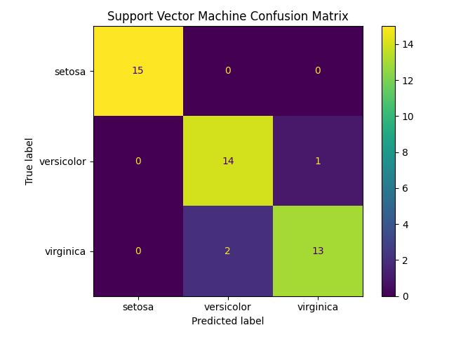
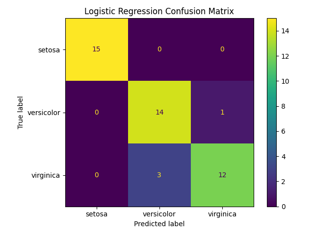
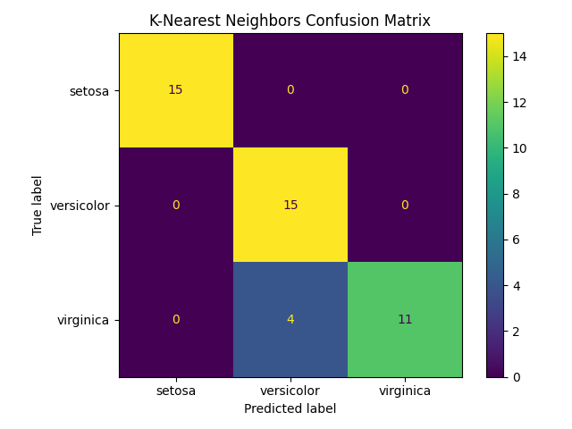

# ML Classification Starter – Iris Dataset 

This project is a small but complete example of a **supervised classification pipeline** in Python.

It shows:
- how to load and explore a dataset (**Iris**, from scikit-learn)
- how to train and compare different classifiers (Logistic Regression, SVM, k-NN)
- how to evaluate them (accuracy, confusion matrix, classification report)
- how to organize a clean ML project

---

## Tech stack

- Python 3.10+
- NumPy
- Pandas (optional)
- scikit-learn
- Matplotlib

Install all dependencies with: pip install -r requirements.txt

## Conclusion and Model Comparison

Across the three classifiers evaluated on the Iris dataset — Logistic Regression, Support Vector Machine (SVM), and k-Nearest Neighbors (k-NN) — all models achieved strong performance, but with meaningful differences in behavior:

- **SVM achieved the highest accuracy (93%)**, showing excellent generalization across all classes.  
  Its strong performance highlights the effectiveness of kernel-based methods, especially when combined with feature scaling.

- **Logistic Regression reached 91% accuracy**, performing particularly well on linearly separable classes such as *setosa*, but showing more confusion between *versicolor* and *virginica*.  
  This is expected, since Logistic Regression models linear decision boundaries.

- **k-NN also reached 91% accuracy**, but with different error patterns:  
  it classified *versicolor* very well, while showing more uncertainty on *virginica*.  
  As a non-parametric method, k-NN is highly sensitive to local structure in the data, and performance can vary depending on the chosen value of *k*.

Overall:

- **SVM** was the most consistent and accurate model. 
 
- **Logistic Regression** provided strong baseline performance with the simplest model. 
 
- **k-NN** performed competitively but was more sensitive to class overlap and neighborhood structure.
 

These results illustrate how algorithmic assumptions (linear vs. nonlinear decision boundaries, parametric vs. non-parametric learning) influence classification performance, even on a small and well-structured dataset like Iris.
